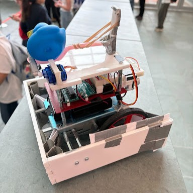

# Mechatronics Final Competition
MAE 3780 Mechatronics final project: Design and build robots to collect and move cubes around an arena during one-minute head-to-head matches. The objective is to gather more cubes than the opposing robot.

	

*Technologies Used: Arduino Uno, C programming, circuit design, motor control, sensor integration.*

For this project, our team designed and built a robot with a fixed 3-walled acrylic frame to trap and guide cubes while maintaining a simple, reliable structure. The robot used Arduino Uno control with C programming. The highlight was a servo-powered rubber band–based launcher that stored potential energy to launch a rubber duck at the start of the match, disrupting opponents.

I primarily worked on programming the Arduino Uno in C using low-level embedded systems control, and handling circuit design and wiring. I configured hardware timers (Timer0, Timer1, and Timer2) to generate PWM signals for motor control and the launcher servo, and implemented a motor control function for precise speed and direction control. Although not used in the final competition code, I also configured color sensor and ultrasonic sensor using timer and pin-change interrupts for color detection and collision avoidance.
